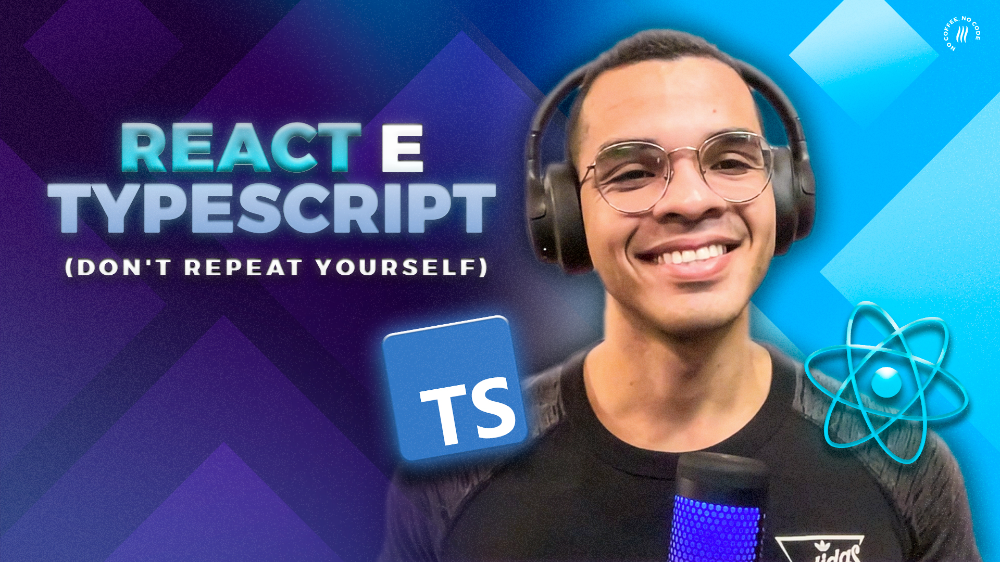

<h2>React Custom Hooks e TypeScript Generics  
</h2>
<h5>Don't Repeat Yourself (DRY) na Prática   </h4>

 

Este projeto foi construído para o vídeo [NÃO REPITA CÓDIGO! React Hooks Personalizado e TypeScript Generics NA PRÁTICA! (Avançado)](https://youtu.be/jfUNQYhyiaY) em nosso canal no YouTube.

### O que você aprenderá nesse tutorial?

Nesse vídeo você encontrará utilização prática para o React Hooks personalizado e TypeScript Generics, dois conceitos considerados avançados e de certa forma complexos, mas ao mesmo tempo muito poderosos.
 

- <b>React Hooks personalizado </b> são funções que começado com "use" e podem conter outros hooks como useState e useEffect. No vídeo criaremos um hooks chamado usePagination para reaproveitar a lógica de paginação em diferentes listas no aplicativo.

   

- <b>TypeScript Generics </b> para permitir que os componentes mantenham as interfaces de suas entidades na listagem, dessa forma continuamos com todo o poder da tipagem estática. Também tomaremos proveito da inferência de tipos do TypeScript para definir de forma implícita essas interfaces ao utilizar o hooks usePagination.

   

### ✅ VOCÊ TAMBÉM VAI GOSTAR DESSES VÍDEOS:

▸ [Programador Sênior | O que Faz? Como se tornar um? (Dicas e Relato Pessoal)](https://youtu.be/TgNPoV2H3Nw)

▸ [TypeScript - Por Que Usar? TypeScript vs JavaScript na PRÁTICA! (Tutorial)](https://youtu.be/r3-a9-bQx0M)

▸ [Playlist TypeScript](https://www.youtube.com/playlist?list=PLn1L40VzKSVJ8ylDbOpYJoHpeUaKEa8xC)

## Redes Sociais:

- Instagram: [@lucasgar6](https://www.instagram.com/lucasgar6/)
- Instagram: [@coffstack](https://www.instagram.com/coffstack/)
- TikTok: [@coffstack](https://www.tiktok.com/@coffstack)
- Twitter: [@coffstack](https://twitter.com/coffstack)
- Blog/Artigos: [Blog Coffstack](https://blog.coffstack.com/)
